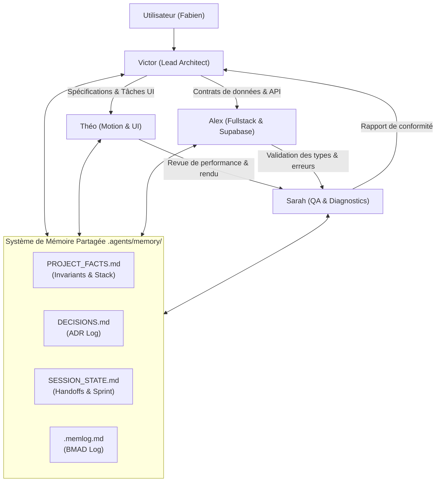

# Architecture Spine — prepa-team & Shared Memory

## 1. Paradigme et Invariants Fondamentaux

* **Modèle Architectural** : *Specialized Multi-Agent Hub-and-Spoke with Git-backed Shared Memory*.
* **Emplacement Unique** : Tous les éléments d'intelligence, de contexte et de mémoire sont confinés dans [.agents/](file:///home/fabien/Documents/Projets/Pro/prepa_website/.agents).
* **Persistance de la Mémoire** : Aucun état critique n'est confié à une mémoire volatile ou à un service tiers non versionné. Le référentiel Markdown (`.agents/memory/`) adossé au format machine `.memlog.md` de BMAD constitue l'unique source de vérité.

---

## 2. Invariants de Décision (AD)

### `AD-1` : Structuration Modulaire de l'Équipe (`prepa-team`)
* **Binds :** La définition des sous-agents sous [.agents/plugins/prepa-team/agents/](file:///home/fabien/Documents/Projets/Pro/prepa_website/.agents/plugins/prepa-team/agents).
* **Prevents :** L'éparpillement des rôles et l'activation de compétences non ciblées (ex. Flutter, outils cyber).
* **Rule :** 4 rôles strictement délimités :
  1. `lead_architect` (Victor) : Gouvernance, BMAD, décisions d'architecture et revue transverse.
  2. `motion_ui_engineer` (Théo) : Composants React 19, Tailwind v4, animations Lenis & Framer Motion.
  3. `fullstack_data_engineer` (Alex) : Routes API Next.js 16, Supabase SSR, schémas TypeScript, Resend.
  4. `quality_assurance_engineer` (Sarah) : Tests React 19 (`react-doctor`), audits Chrome DevTools et Web Vitals.

### `AD-2` : Architecture Tripartite de la Mémoire
* **Binds :** L'organisation du répertoire [.agents/memory/](file:///home/fabien/Documents/Projets/Pro/prepa_website/.agents/memory).
* **Prevents :** Les conflits de contexte, la redondance d'analyse et les hallucinations d'APIs.
* **Rule :**
  1. `PROJECT_FACTS.md` : Mémoire sémantique permanente (invariants de versions, arborescence, conventions).
  2. `DECISIONS.md` : Journal append-only des Architecture Decision Records (ADR).
  3. `SESSION_STATE.md` : Mémoire épisodique de travail et handoffs inter-agents.
  4. `.memlog.md` : Registre chronologique d'événements pour le script `memlog.py` de BMAD.

### `AD-3` : Contrainte Inviolable sur les Versions Next.js 16
* **Binds :** Tout sous-agent modifiant du code fonctionnel.
* **Prevents :** L'usage de syntaxes dépréciées ou imaginées sur Next.js 16 / React 19.
* **Rule :** L'inspection préalable de `node_modules/next/dist/docs/` est obligatoire avant toute modification touchant au routage, aux cookies, aux en-têtes ou aux Server Actions.

---

## 3. Flux d'Interaction et Handover Inter-Agents

---

## 4. Éléments Différés (Deferred)

* L'intégration d'un canal d'export automatisé de la mémoire vers une base Notion (via le serveur `notion-mcp-server`) est différée à la phase où un partage documentaire hors-code sera expressément requis.
